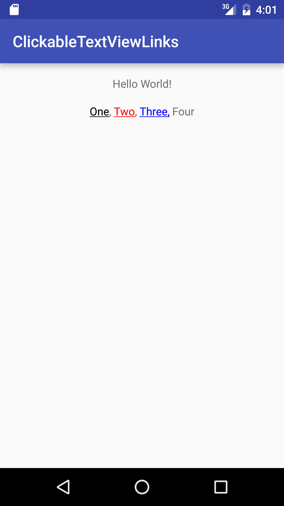

# ClickableTextViewLinks
TextView enhancement allowing the ability to set click listeners to one or more substrings in the textview.</br>
This class extends TextView and exposes methods to create Clickable Spans on different Substrings of the TextView's text.

</img>


Code Snippet
```Java
  super.onCreate(savedInstanceState);
  setContentView(R.layout.activity_main);

  ClickableTextView textView = (ClickableTextView) findViewById(R.id.clickedTextView);

  String testString = "One, Two, Three, Four";
  textView.setText(testString);

  // Create First Link Substring
  ClickableLink link1 = new ClickableLink("One", new ClickableSpan() {
      @Override
      public void onClick(View widget) {
          Toast.makeText(widget.getContext(), "Clicked One", Toast.LENGTH_LONG).show();
      }
  });

  // Create Second Link Substring
  ClickableLink link2 = new ClickableLink("Two", new ClickableSpan() {
      @Override
      public void onClick(View widget) {
          Toast.makeText(widget.getContext(), "Clicked Two", Toast.LENGTH_LONG).show();
      }
  }, Color.RED);

  // Create Third Link Substring
  ClickableLink link3 = new ClickableLink("Three,", new ClickableSpan() {
      @Override
      public void onClick(View widget) {
          Toast.makeText(widget.getContext(), "Clicked Three", Toast.LENGTH_LONG).show();
      }
  }, Color.BLUE);

  textView.addLinks(link1, link2, link3);
```

<b>Known Issues:</b></br>
Currently does not support multiple substrings of the same value.</br>
> Ex: "This This is a test"</br>
> Only the first "This" will have a link.
